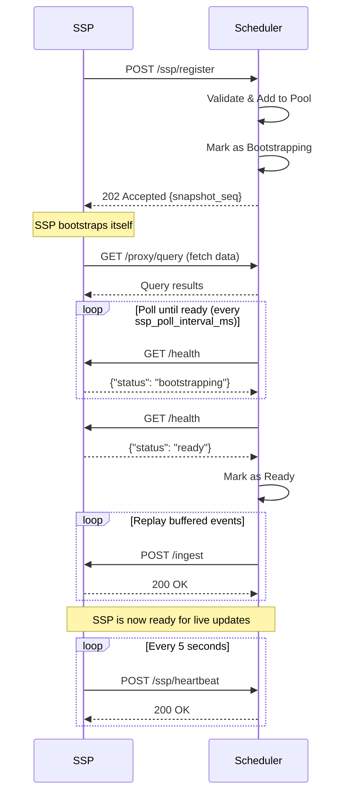

import CodeBlock from '../../../components/ui/CodeBlock.astro';

The Scheduler is the central orchestrator that manages SSP sidecars and coordinates data distribution.

## Base URL

Default: `http://localhost:9667`

The bind address comes from the scheduler's YAML config:

```yaml
ingest_host: 0.0.0.0   # optional; falls back to 0.0.0.0
ingest_port: 9667
```

A subset of fields can also be overridden with `SPKY_*` env vars
(`SPKY_DB_URL` (or legacy `SPKY_DB_WS`), `SPKY_DB_NS`, `SPKY_DB_NAME`, `SPKY_DB_USER`,
`SPKY_DB_PASS`, `SPKY_SCHEDULER_ID`,
`SPKY_SNAPSHOT_UPDATE_INTERVAL_SECS`, `SPKY_BACKENDS` (or legacy `SPKY_SCHEDULER_BACKENDS`)).
The bind host/port are YAML-only.

## Ports

The scheduler listens on **three** ports, and the distinction matters for how you
expose it:

| Port | Env | Serves | Exposure |
| --- | --- | --- | --- |
| `9667` | `ingest_port` (YAML) | `/ingest`, `/proxy/*`, `/view/*`, `/ssp/*`, `/job/*`, `/metrics`, `/health*`, `/info`, `/backup/*` | **Private network only** |
| `9668` | `SPKY_ADMIN_PORT` | `/admin` (dashboard) and `/admin/api/*` | Safe to publish |
| `9669` | `SPKY_POOL_PORT` | `/pool/v1/*`, the [machine pool](/docs/jobs/machine-pools) agents' connection | Publish when pool machines live outside the scheduler's network |

## Authentication

**Port 9667 is unauthenticated.** That includes `POST /proxy/query`, which runs
arbitrary SurrealQL against the scheduler's replica. Treat reachability of this
port as equivalent to full read access to your data, and keep it inside a
private network, VPC or firewall.

**Port 9668 is authenticated.** Every endpoint under `/admin/api` requires a
bearer token except `GET /admin/api/config`. See
[Admin dashboard](/docs/reference/admin-dashboard).

This split is why the dashboard has its own listener: it is the one surface
meant for a browser, so it can be published without publishing the ingest port
alongside it.

---

## Data Ingestion

### POST /ingest

Ingest a record change from the database. This endpoint receives database events and broadcasts them to all ready SSP sidecars.

**Request Body:**

```json
{
  "table": "users",
  "op": "CREATE",
  "id": "user:123",
  "record": {
    "name": "Alice",
    "email": "alice@example.com"
  }
}
```

**Fields:**
- `table` (string, required) - Table name
- `op` (string, required) - Operation: `CREATE`, `UPDATE`, or `DELETE`
- `id` (string, required) - Record ID
- `record` (object, required) - Record data

**Response:**
- `200 OK` - Successfully ingested and broadcast to SSPs
- `400 Bad Request` - Invalid operation or malformed request
- `500 Internal Server Error` - Failed to apply to replica or broadcast
- `503 Service Unavailable` - Scheduler is in `Cloning` state

**Example:**

```bash
curl -X POST http://localhost:9667/ingest \
  -H "Content-Type: application/json" \
  -d '{
    "table": "users",
    "op": "CREATE",
    "id": "user:alice",
    "record": {"name": "Alice", "email": "alice@example.com"}
  }'
```

---

## Proxy Endpoints

SSPs use these endpoints during bootstrap to query the scheduler's snapshot replica directly, instead of receiving pushed chunks.

### POST /proxy/query

Execute a SurrealQL query against the scheduler's frozen snapshot replica. SSPs use this to self-bootstrap by pulling the data they need.

**Request Body:**

```json
{
  "query": "SELECT * FROM users"
}
```

**Response:**
- `200 OK` - Query results from the snapshot replica
- `400 Bad Request` - Invalid query
- `500 Internal Server Error` - Query execution failed

**Example:**

```bash
curl -X POST http://localhost:9667/proxy/query \
  -H "Content-Type: application/json" \
  -d '{"query": "SELECT * FROM users"}'
```

### POST /proxy/signin

No-op endpoint for SurrealDB client compatibility during SSP bootstrap. Returns success without performing authentication.

**Response:**
- `200 OK` - Always succeeds

### POST /proxy/use

No-op endpoint for SurrealDB client compatibility during SSP bootstrap. Returns success without changing namespace/database context.

**Response:**
- `200 OK` - Always succeeds

---

## View Management

### POST /view/register

Register a new view (live query) with the scheduler. The scheduler will assign it to an SSP using the configured load balancing strategy.

**Request Body:**

```json
{
  "id": "query:abc123",
  "surql": "SELECT * FROM users WHERE active = true",
  "clientId": "client-456",
  "ttl": "30s",
  "params": null,
  "lastActiveAt": "2024-01-01T00:00:00Z",
  "format": null
}
```

**Fields:**
- `id` (string, required) - Unique view identifier (e.g. `query:abc123`)
- `surql` (string, required) - SurrealQL query to materialize
- `clientId` (string, required) - Client identifier
- `ttl` (string, required) - Time-to-live for the view (e.g. `"30s"`)
- `params` (object, optional) - Query parameters
- `lastActiveAt` (string, optional) - ISO 8601 timestamp of last activity
- `format` (string, optional) - Response format

**Response:**
- `200 OK` - View registered and assigned to an SSP
  ```json
  {
    "query_id": "query:abc123",
    "ssp_id": "ssp-primary-01",
    "assigned_at": 1707654321
  }
  ```
- `400 Bad Request` - The SSP rejected the payload (`rejected`); relayed verbatim
- `403 Forbidden` - The SSP refused the shape under the query allowlist (`not_allowlisted`); relayed verbatim
- `409 Conflict` - The SSP found the view registered under another identity (`auth_mismatch`); relayed verbatim
- `503 Service Unavailable` - No SSPs available

The SSP's own verdict is relayed with its status: a 4xx is the client's problem and reaches it as
such, not folded into a 500 that reads as an outage. The body is the SSP's
`{"error": "...", "message": "..."}` unchanged. See the SSP's
[`POST /view/register`](/docs/reference/ssp-api#post-viewregister).

**Example:**

```bash
curl -X POST http://localhost:9667/view/register \
  -H "Content-Type: application/json" \
  -d '{
    "id": "query:abc123",
    "surql": "SELECT * FROM users WHERE active = true",
    "clientId": "client-456",
    "ttl": "30s"
  }'
```

### POST /view/unregister

Unregister a view from its assigned SSP.

**Request Body:**

```json
{
  "id": "query:abc123"
}
```

**Response:**
- `200 OK` - Teardown accepted. The tracker is cleared before the response;
  the SSP is told in the background, so a caller (the `_00_dbsp_cleanup` DB
  event under the `http` transport, which runs inside the transaction that
  deleted the `_00_query` row) never waits on the SSP.
- An unknown view is also `200` (idempotent).

A teardown is dropped when the same view id was registered again after the
delete it stems from (a tab closed and reopened): the registration's
timestamp wins over an older delete. Under the `changefeed` transport this
route is not called by the database at all; the scheduler reads the
`_00_query` DELETE from the feed and applies the same rule.

---

## SSP Lifecycle Management

### POST /ssp/register

Register a new SSP sidecar with the scheduler. The scheduler will immediately mark the SSP as bootstrapping and begin sending replica data asynchronously.

**Request Body:**

```json
{
  "ssp_id": "ssp-primary-01",
  "url": "http://localhost:8667"
}
```

**Fields:**
- `ssp_id` (string, required) - Unique identifier for the SSP
- `url` (string, required) - HTTP URL of the SSP (must start with http:// or https://)

**Response:**
- `202 Accepted` - Registration accepted, bootstrap starting
  ```json
  { "snapshot_seq": 123 }
  ```
- `400 Bad Request` - Invalid SSP ID (empty) or invalid URL format

**Flow:**
1. SSP sends registration request
2. Scheduler validates and adds SSP to pool
3. Scheduler marks SSP as "bootstrapping"
4. SSP bootstraps itself from the scheduler's `/proxy/query` endpoint
5. Scheduler polls SSP `/health` until it reports `ready`
6. Once ready, scheduler replays buffered events to SSP

**Example:**

```bash
curl -X POST http://localhost:9667/ssp/register \
  -H "Content-Type: application/json" \
  -d '{
    "ssp_id": "ssp-primary-01",
    "url": "http://localhost:8667"
  }'
```

### POST /ssp/heartbeat

Send a heartbeat from an SSP to maintain health status.

**Request Body:**

```json
{
  "ssp_id": "ssp-primary-01",
  "timestamp": 1707654321,
  "views": 5,
  "cpu_usage": 45.2,
  "memory_usage": 512.5
}
```

**Fields:**
- `ssp_id` (string, required) - SSP identifier
- `timestamp` (number, required) - Unix timestamp in seconds
- `views` (number, required) - Number of active views
- `cpu_usage` (number, optional) - CPU usage percentage
- `memory_usage` (number, optional) - Memory usage in MB

**Response:**
- `200 OK` - Heartbeat accepted
- `404 Not Found` - SSP not registered (SSP should re-register)
- `409 Conflict` - The SSP must exit and re-bootstrap. The body is a JSON `ResyncDirective`:

```json
{ "reason": "Clean restart requested. SSP must drop its snapshot and re-bootstrap.", "clean": true }
```

`clean: true` asks the SSP to delete its circuit snapshot and arena before it
exits, so the relaunch is a cold rebuild. A buffer overflow, an integrity-check
resync and an operator restart from the [admin dashboard](/docs/reference/admin-dashboard#restarting-an-ssp)
all arrive this way. Older SSPs read the body as free text and restart anyway,
and an older scheduler sends free text, which parses as `clean: false`; both
directions degrade to a plain restart, never to a refused one.

**Example:**

```bash
curl -X POST http://localhost:9667/ssp/heartbeat \
  -H "Content-Type: application/json" \
  -d '{
    "ssp_id": "ssp-primary-01",
    "timestamp": 1707654321,
    "views": 5,
    "cpu_usage": 45.2,
    "memory_usage": 512.5
  }'
```

### POST /ssp/bootstrap-progress

Report how far an SSP has got loading its circuit. Advisory only: the value is
surfaced on `/info` and the admin dashboard and is read by nothing that makes a
bootstrap decision, so it always answers `200` and is never retried.

Sent by the SSP's bootstrap loop rather than its heartbeat, because the
heartbeat stays silent until the SSP reaches `ready` — which is exactly the
window this describes.

**Request Body:**

```json
{
  "ssp_id": "ssp-primary-01",
  "tables_done": 12,
  "tables_total": 30,
  "rows_loaded": 148230,
  "current_table": "message"
}
```

**Fields:**
- `ssp_id` (string, required) - SSP identifier
- `tables_done` (number) - Tables fully loaded so far
- `tables_total` (number) - Tables to load in total; `0` when not yet known
- `rows_loaded` (number) - Rows loaded across all tables
- `current_table` (string, optional) - Table currently loading

**Response:**
- `200 OK` - Always, including for an unknown or already-ready SSP

---

## Job Scheduling

### POST /job/dispatch

Dispatch a job to be executed on an SSP.

**Request Body:**

```json
{
  "job_id": "job:123",
  "table": "job",
  "payload": {
    "path": "/api/process",
    "body": {"data": "value"}
  }
}
```

**Fields:**
- `job_id` (string, required) - Job record ID
- `table` (string, required) - Job table name
- `payload` (object, required) - Job payload data

**Response:**
- `200 OK` - Job dispatched, returns the assigned SSP ID string
- `503 Service Unavailable` - No SSPs available

### POST /job/result

Report job execution results from an SSP back to the scheduler.

**Request Body:**

```json
{
  "job_id": "job:123",
  "status": "completed",
  "result": {"output": "processed"},
  "error": null
}
```

**Fields:**
- `job_id` (string, required) - Job record ID
- `status` (string, required) - Job status: `pending`, `running`, `completed`, or `failed`
- `result` (object, optional) - Job result data
- `error` (string, optional) - Error message if failed

**Response:**
- `200 OK` - Result recorded

### Job operator actions

Outbox jobs are routed by the ingest path rather than `/job/dispatch`, so the
scheduler does not know which SSP holds a given job. These three routes work
around that; they are what `fn::job::kill`, `fn::job::retry`, the recovery
sweep and the admin dashboard call.

| Endpoint | Body | Behaviour |
| --- | --- | --- |
| `POST /job/kill` | `{"id": "job:abc"}` | Broadcast to every ready SSP. A kill is idempotent and harmless on SSPs that do not host the job: only the one with the request in flight cancels it, the rest set a kill flag. `200 {id, dispatched, ssps}`; `503 no_ssp` with none ready |
| `POST /job/retry` | `{"id": "job:abc"}` | Picks exactly one ready SSP and forwards, because a retry re-enqueues into that SSP's runner and broadcasting would run the job N times. The SSP's own verdict is relayed with its status: `409 not_terminal` for a job that is still pending or processing, `404` for an unknown one. `200 {id, status: "pending", assigned_to}` |
| `POST /job/recover` | (SSP route) | Called on one SSP by the scheduler's 30 s recovery sweep for `pending` rows nothing picked up and `processing` rows that went stale; the SSP stamps itself as assignee and enqueues them |

---

## Impersonation

Two routes behind the `fn::_00_impersonate::*` SurrealDB functions (see
[Admin impersonation](/docs/client/impersonation)). Both return `404` unless
`SPKY_IMPERSONATION=on` and `SPKY_AUTH_SECRET` is non-empty. The scheduler serves
them in cluster mode, where the functions call it instead of an SSP. The rest of the ingest port is unauthenticated; these two routes check the bearer themselves, in constant time.

**Authentication:** Required (the shared bearer)

| Endpoint | Body | Behaviour |
| --- | --- | --- |
| `POST /impersonate/mint` | `{"session", "target", "admin", "access", "ns", "db", "ttl_secs", "session_remaining_secs"}` | Signs an HS256 token for the `_00_impersonate` access method, bound to the `_00_impersonation` row in `session`. Expiry is `min(ttl_secs, 1h, session_remaining_secs)`. Stateless: every revocation check runs in the access method's `AUTHENTICATE` block. `200 {token, exp}`; `400 invalid` for a session that is not an `_00_impersonation` record, a target equal to the admin, or an expired session |
| `POST /impersonate/users` | `{"table", "fields", "search", "limit"}` | Root-backed search for the DevTools user picker: rows of `table` whose id or any of `fields` contains `search` (case-insensitive), at most `limit` (max 100), each with `is_admin`. `table` and `fields` must be plain identifiers (`400 invalid` otherwise) |

---

## Monitoring

### GET /metrics

Get scheduler metrics and SSP pool status.

**Response:**

```json
{
  "scheduler": {
    "total_ssps": 2,
    "ready_ssps": 2,
    "total_queries": 10,
    "running_jobs": 3,
    "uptime_seconds": 3600
  },
  "ssps": [
    {
      "id": "ssp-primary-01",
      "query_count": 5,
      "views": 3,
      "cpu_usage": 45.2,
      "memory_usage": 512.5,
      "last_heartbeat_seconds_ago": 2
    }
  ]
}
```

**Example:**

```bash
curl http://localhost:9667/metrics
```

### GET /health

Health check endpoint.

**Response:**
- `200 OK` - At least one SSP is ready
  ```json
  {"status": "healthy"}
  ```
- `503 Service Unavailable` - No SSPs are ready
  ```json
  {"status": "unavailable"}
  ```

The body also carries `scheduler` (replica lag), `heartbeat` (the end-to-end
probe) and `changefeed`:

```json
{
  "changefeed": {
    "enabled": true,
    "cursor_ms": 1789416134292,
    "lag_ms": 7,
    "records_1m": 80,
    "doorbell": "connected",
    "doorbell_reconnects": 0,
    "gap": false,
    "stalled": false,
    "last_error": null
  }
}
```

`enabled` is `false` under `SPKY_INGEST_TRANSPORT=http`. `lag_ms` is the age
of the tail's cursor, i.e. how far behind the newest commit it can be at
most. `gap` means the cursor fell out of the feed's retention and the
replica is being re-cloned; `stalled` means no poll has completed for a
while. Either one reports the stack `degraded`.

**Example:**

```bash
curl http://localhost:9667/health
```

### GET /health/snapshot

Per-table replica record counts and content hashes, plus the scheduler's
own replica-vs-upstream verdict. `spky verify` reads this.

The replica is cloned from upstream once and then fed only by the per-row
ingest events, so rows written while nothing was listening (a bulk migration
with the stack down) never reach it, and every SSP that bootstraps from it
inherits the gap. The scheduler compares row counts against upstream at
startup and after every snapshot drain that leaves nothing buffered. A table
that is empty in the replica but not upstream is acted on at once, any other
mismatch once it persists across consecutive checks. The table is repaired in
place (the rows that differ go through the ingest pipeline); only a repair
that cannot fix it re-clones the replica and re-bootstraps every SSP. A table
new to the replica (added upstream while the scheduler ran, or with `@nosync`
removed) is backfilled instead: uncapped, in the background, never re-cloned
for.

The replica also follows upstream's table set on the same tick: a table
dropped upstream, or marked `@nosync`, is dropped from the replica (rows and
hash) once two consecutive probes agree, and a table's opaque fields are
re-read whenever the schema changes. Both are recorded as `schema_change`
incidents.

**Response:**
- `200 OK`
  ```json
  {
    "tables": { "thread": 12, "user": 3 },
    "hashes": { "thread": "ab12…", "user": "cd34…" },
    "total_records": 15,
    "snapshot_seq": 230046,
    "latest_seq": 230046,
    "lag": 0,
    "drift": {
      "enabled": true,
      "auto_reclone_enabled": true,
      "checked_at": 1788310193130,
      "tables": { "thread": { "upstream": 12, "replica": 12 } },
      "mismatched": [],
      "stuck": [],
      "last_auto_reclone": null,
      "auto_reclones": 0,
      "last_auto_repair": null,
      "auto_repairs": 0,
      "repair_max_rows": 2000,
      "backfilling": [],
      "last_error": null
    }
  }
  ```

`drift.mismatched` lists tables whose counts differed on the last check.
`drift.stuck` lists tables an automatic repair or re-clone did not fix; those
need an operator (a row the replica schema rejects, typically).
`drift.auto_repairs` counts in-place table repairs (backfills included),
`drift.auto_reclones` the full re-clones a repair escalated to.
`drift.backfilling` lists the new tables being backfilled right now. `drift.upstream` is
`null` for a table whose upstream count could not be read.

**Example:**

```bash
curl http://localhost:9667/health/snapshot
```

### GET /info

Get entity information for the scheduler and all registered SSPs.

**Response:**
- `200 OK` - Entity list
  ```json
  [
    { "entity": "scheduler", "id": "scheduler-abc", "status": "ready", "views": 8 },
    { "entity": "ssp", "id": "ssp-01", "status": "ready", "views": 3 }
  ]
  ```

**Example:**

```bash
curl http://localhost:9667/info
```

---

## Bootstrap Flow

When an SSP registers, the following poll-based bootstrap process occurs:



### Message Buffering

While an SSP is bootstrapping, the scheduler buffers incoming messages:
- Maximum buffer size: 10,000 messages per SSP (configurable via `max_buffer_per_ssp`)
- Buffer exists both globally (event_buffer) and per-SSP
- If buffer overflows: SSP marked for re-bootstrap, buffer cleared
- Heartbeat returns `409 Conflict` when buffer overflow occurs

---

## Configuration

Configure the scheduler via `sp00ky.yml` or environment variables:

```yaml
# Database connection
db:
  url: "localhost:8000/rpc"
  namespace: "sp00ky"
  database: "sp00ky"
  username: "root"
  password: "root"

# Load balancing strategy
load_balance: "least_queries"  # Options: round_robin, least_queries, least_load

# SSP heartbeat monitoring
heartbeat_interval_ms: 5000
heartbeat_timeout_ms: 15000

# Bootstrap configuration
bootstrap_chunk_size: 1000
bootstrap_timeout_secs: 120

# Replica storage
replica_db_path: "./data/replica"

# WAL (Write-Ahead Log)
wal_path: "./data/event_wal.log"

# Server configuration
ingest_host: "0.0.0.0"
ingest_port: 9667

# SSP polling and buffering
ssp_poll_interval_ms: 3000
max_buffer_per_ssp: 10000

# Snapshot update interval (seconds)
snapshot_update_interval_secs: 300

# Job tables (tables that trigger job execution)
job_tables:
  - "job"
```

**Environment Variables (overrides for YAML fields):**

- `SPKY_SCHEDULER_ID` - Unique scheduler identifier (defaults to `scheduler-<uuid>`)
- `SPKY_DB_URL` - SurrealDB URL (overrides `db.url`; HTTP engine, `ws://` values are accepted and normalized). `SPKY_DB_WS` is read as a legacy fallback.
- `SPKY_DB_NS` - SurrealDB namespace (overrides `db.namespace`)
- `SPKY_DB_NAME` - SurrealDB database (overrides `db.database`)
- `SPKY_DB_USER` - SurrealDB username (overrides `db.username`)
- `SPKY_DB_PASS` - SurrealDB password (overrides `db.password`)
- `SPKY_IMPERSONATION` - `on` serves `/impersonate/mint` and `/impersonate/users` (default: off; set from `impersonation.enabled`)
- `SPKY_SNAPSHOT_UPDATE_INTERVAL_SECS` - Override for `snapshot_update_interval_secs` (default: `300`)
- `SPKY_DRIFT_CHECK` - Compare replica row counts against upstream at startup and after each snapshot drain (default: `true`)
- `SPKY_DRIFT_AUTO_RECLONE` - Act on a confirmed mismatch (default: `true`; `false` reports only, via `/health/snapshot`, `/metrics` and `spky verify`). The table is repaired in place: its ids and `_00_rv`s are compared with upstream, and the rows that are missing, stale or deleted go through the ingest pipeline as ordinary events, so the replica and every SSP converge without a bootstrap. Only a repair that finds no difference, would exceed `SPKY_DRIFT_REPAIR_MAX_ROWS`, or fails falls back to re-cloning the replica and re-bootstrapping every SSP. A table still off after either is reported as stuck until its counts change
- `SPKY_DRIFT_CONFIRM_TICKS` - Consecutive checks a non-zero count mismatch must persist before it is acted on; an empty replica table upstream has rows for is acted on at first sight (default: `2`)
- `SPKY_DRIFT_RECLONE_COOLDOWN_SECS` - Minimum spacing between automatic re-clones (default: `3600`)
- `SPKY_DRIFT_REPAIR_MAX_ROWS` - Most rows one in-place repair of a table the replica already held may send through the ingest pipeline (default: `2000`). A table new to the replica is backfilled with no cap
- `SPKY_DRIFT_REPAIR_TIMEOUT_SECS` - Deadline for one table repair, and the longest any repair (a backfill included) may go without finishing a page; on the deadline it is abandoned, the upstream connection is replaced and the repair is retried on the next check (default: `300`)
- `SPKY_DRIFT_CHECK_TIMEOUT_SECS` - Deadline for one drift check. The check is the last step of the snapshot updater's tick, so a check that never answers would stop the replica draining; on the deadline it is abandoned, the upstream connection is replaced and the tick finishes (default: `120`)
- `SPKY_BACKENDS` - JSON-encoded backend health-check list (`SPKY_SCHEDULER_BACKENDS` accepted as legacy fallback)
- `SPKY_BOOTSTRAP_PAGE_SIZE` - Rows read per bootstrap page from the replica (default: `500`)
- `SPKY_CLEAR_VIEWS_ON_START` - Wipe `_00_query` at startup (default: `true`). `false` keeps registered views across a scheduler restart: the replica clones them, SSPs re-register them at bootstrap, clients never notice; the SSP TTL sweep retires expired ones. Single-SSP tenants only until scheduler-owned view assignment lands.
- `SPKY_AUTH_SECRET` - Optional shared secret; when set, SSP clients are required to send `Authorization: Bearer <secret>` on `/proxy/*`

Every other field (`ingest_host`, `ingest_port`, `load_balance`,
`heartbeat_*`, `bootstrap_chunk_size`, `bootstrap_timeout_secs`,
`replica_db_path`, `wal_path`, `ssp_poll_interval_ms`,
`max_buffer_per_ssp`, `job_tables`) is set via `sp00ky.yml`. There
is no env-var override path for them.

---

## Error Handling

### Common Status Codes

- `200 OK` - Request successful
- `202 Accepted` - Request accepted for async processing
- `400 Bad Request` - Invalid request format or parameters
- `404 Not Found` - Resource not found (e.g., unregistered SSP)
- `409 Conflict` - State conflict (e.g., buffer overflow)
- `403 Forbidden` - Relayed from the SSP on `/view/register`: the query shape is not allowlisted (`not_allowlisted`)
- `500 Internal Server Error` - Server error
- `503 Service Unavailable` - No SSPs available

### SSP Health Monitoring

The scheduler monitors SSP health via heartbeats:
- SSPs should send heartbeats every 5 seconds (configurable)
- Scheduler marks SSPs as stale after 15 seconds without heartbeat (configurable)
- Stale SSPs are removed from the pool
- Queries assigned to stale SSPs are reassigned to healthy SSPs

## Persistent incident API

These authenticated, read-only endpoints are on the admin listener:

- `GET /admin/api/incidents`: newest-first history. Optional filters: `component`,
  `state` (`open`, `recovered`, `interrupted`, `failed`, `recorded`), `severity`
  (`warning`, `info`), `since` and `before` (start-time epoch milliseconds).
  `offset` defaults to 0; `limit` defaults to 50 and is clamped to 1-200.
  Returns `incidents`, `total`, `offset`, `limit`, `storage_error`, and `server_time_ms`.
- `GET /admin/api/incidents/:id`: returns `incident`, or 404 after retention removed it.
- `GET /admin/api/overview` includes `incidents` with `open`, `total`,
  `retention_days`, and `storage_error`.

`kind` names what happened. Besides the SSP and scheduler lifecycle kinds, two
are worth knowing because nothing else reports them: `backend_down` opens when a
backend has failed its health check for longer than a minute and recovers when it
answers again (its `component` is the backend name), and `schedule_quarantined`
opens when a schedule's per-key failure budget stops firing one `forEach` key
(its `component` is `schedule:<name>/<key>`) and recovers when that key fires
again, after a passing probe or a release. See
[Failing keys](/docs/jobs/schedules#failing-keys).

An incident carries `id`, `component`, `kind`, `severity`, `state`, `started_at`,
`ended_at`, `max_buffered_events`, `event_count`, and `events`. Each event has
`at`, `component`, `kind`, `state`, `summary`, `operation_id`, and `version`.
Times are epoch milliseconds. The backlog is sampled, so it is a lower bound
on the true peak. Event summaries are sanitized descriptions, not raw SQL.
MCP tools `incidents_list` and `incident_get` share these endpoints and permissions.
See [incident retention and restart semantics](/docs/reference/admin-dashboard#incident-history).


Incident records may also include `publication`, the last nonempty SSP heartbeat
snapshot sampled while the episode was open, plus `max_publication_operations`,
`max_publication_bytes`, and `max_publication_age_ms`. These are sampled peaks,
not a complete transaction trace. `publication.worst_views` contains at most
eight query IDs and backlog sizes, with no source rows or query bindings.
Older history files and SSPs omit these optional details. Each SSP in the
overview exposes the latest `publication` snapshot, or `null` when unavailable.
