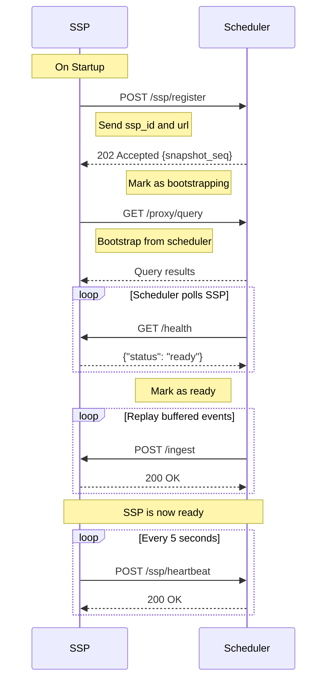

import CodeBlock from '../../../components/ui/CodeBlock.astro';

The SSP (Sp00ky Sidecar Processor) is a stateful service that maintains materialized views and executes backend functions.

## Base URL

Default: `http://localhost:8667`

Configure via: `SPKY_SSP_LISTEN_ADDR` environment variable (form `host:port`).

## Authentication

All endpoints (except `/health`, `/version`, and `/info`) require authentication via the `Authorization` header:

```
Authorization: Bearer <SPKY_AUTH_SECRET>
```

Set via `SPKY_AUTH_SECRET` environment variable. When unset, the middleware accepts any bearer token and is intended for dev only.

---

## Data Ingestion

### POST /ingest

Process a single record update and propagate changes to affected views.

**Authentication:** Required

**Request Body:**

```json
{
  "table": "users",
  "op": "CREATE",
  "id": "user:123",
  "record": {
    "name": "Alice",
    "email": "alice@example.com"
  }
}
```

**Fields:**
- `table` (string, required) - Table name
- `op` (string, required) - Operation: `CREATE`, `UPDATE`, or `DELETE`
- `id` (string, required) - Record ID
- `record` (object, required) - Record data. For tables generated by
  the Sp00ky CLI's schema event, `record._00_rv` carries the row's
  content version (bumped inside the source transaction). The SSP
  polls `_00_version` for that record before issuing the per-user
  edge update, so list_ref bumps never race ahead of the source
  row's visibility on other connections.

**Response:**
- `200 OK` - Record accepted. Returned **immediately** after the
  in-memory DBSP step; the database fan-out
  (`UPDATE _00_list_ref_user_<id>`, view-metric persistence) runs in
  a background task so the caller's transaction (the schema event
  that invoked `http::post`) can commit without waiting on it. Side
  effects: when `table = "user"` and `op = "CREATE"`, the SSP
  pre-emptively defines that user's dedicated
  `_00_list_ref_user_<id>` table (no-op in `refMode: single`); when
  `op = "DELETE"`, it drops the same table.
- `400 Bad Request` - Invalid operation or malformed request
- `401 Unauthorized` - Missing or invalid authentication
- `503 Service Unavailable` - SSP is not in Ready state (`SSP_NOT_READY`)

**Example:**

```bash
curl -X POST http://localhost:8667/ingest \
  -H "Content-Type: application/json" \
  -H "Authorization: Bearer your-secret-token" \
  -d '{
    "table": "users",
    "op": "CREATE",
    "id": "user:alice",
    "record": {"name": "Alice", "email": "alice@example.com"}
  }'
```

**Job Processing:**

If the ingested table is configured as a job table and the record has `status: "pending"`, the SSP will automatically queue and execute the job.

---

## Bootstrap

When running in scheduler mode, the SSP bootstraps itself using a **proxy-based pull** pattern rather than receiving pushed chunks:

1. SSP registers with the scheduler via `POST /ssp/register`
2. Scheduler freezes its snapshot replica and returns `snapshot_seq`
3. SSP connects to the scheduler's proxy endpoints (`POST /proxy/query`, `/proxy/signin`, `/proxy/use`) as if they were a SurrealDB instance
4. SSP executes its own SurrealQL queries to pull the data it needs
5. Once bootstrapped, SSP reports healthy via `GET /health` (returns `{"status": "ready"}`)
6. Scheduler detects readiness, replays buffered events, then promotes SSP to `Ready`

This approach is more efficient than chunk pushing because the SSP only fetches the data it actually needs, and the scheduler doesn't need to know the SSP's data requirements.

**Notes:**
- During bootstrap, the SSP's `/health` endpoint returns `{"status": "bootstrapping"}`
- The scheduler polls `/health` every `ssp_poll_interval_ms` (default: 3 seconds)
- Bootstrap must complete within `bootstrap_timeout_secs` (default: 120 seconds)
- If the scheduler's per-SSP message buffer overflows (max 10,000), the SSP must re-bootstrap

---

## View Management

### POST /view/register

Register a new view (live query) with the SSP.

**Authentication:** Required

**Request Body:**

```json
{
  "id": "query:abc123",
  "surql": "SELECT * FROM users WHERE active = true",
  "clientId": "client-456",
  "ttl": "30s",
  "params": null,
  "lastActiveAt": "2024-01-01T00:00:00Z",
  "format": null
}
```

**Fields:**
- `id` (string, required) - Unique view identifier (e.g. `query:abc123`)
- `surql` (string, required) - SurrealQL query to materialize
- `clientId` (string, required) - Client identifier
- `ttl` (string, required) - Time-to-live for the view (e.g. `"30s"`)
- `params` (object, optional) - Query parameters
- `lastActiveAt` (string, optional) - ISO 8601 timestamp of last activity
- `format` (string, optional) - Response format

**Response:**
- `200 OK` - View registered, initial results returned
- `400 Bad Request` - Invalid view registration payload
- `401 Unauthorized` - Missing or invalid authentication
- `403 Forbidden` - The query's shape is not in the query allowlist and
  `SPKY_SSP_QUERY_ALLOWLIST=enforce`. Body:
  ```json
  {
    "error": "not_allowlisted",
    "message": "shape of query on `game` is not in the allowlist (42 entries from 2 releases). Regenerate the allowlist (spky generate) and redeploy."
  }
  ```
  Decided on the parsed shape before any database write, so a refused
  registration leaves no `_00_query` row behind. Under `warn` the same miss is
  logged (`allowlist miss (warn mode): admitted`, target `ssp::policy`) and the
  view registers. The scheduler relays this status and body to the client
  unchanged. Shapes over `_00_app_release` / `_00_user_feature` are always
  admitted. See the [Query allowlist guide](/docs/guide/query-allowlist).
- `503 Service Unavailable` - SSP is not in Ready state (`SSP_NOT_READY`)

**What the SSP writes:** the `_00_query` row for the view (`UPSERT`) with
`rowCount` (the size of the initial set) and `state`. A view with rows is
written `state = 'materializing'` and its edges go to the edge flusher; the
batch that commits those `_00_list_ref` edges also sets `state = 'ready'`, in
the same transaction, and first deletes any edges the row already had (a full
publish replaces, never duplicates). A view with no rows is written
`state = 'ready'` at once. Clients read `state` next to the edges: `ready` with
`rowCount 0` is a real empty result, `materializing` is a publish in flight,
and a missing row means the SSP no longer has the view (they keep their rows
and re-register). Re-registering a view the SSP already holds only refreshes
`clientId`, `lastActiveAt`, `ttl` and `subscribers`; it re-publishes only when
the row or its edges are found missing.

**Example:**

```bash
curl -X POST http://localhost:8667/view/register \
  -H "Content-Type: application/json" \
  -H "Authorization: Bearer your-secret-token" \
  -d '{
    "id": "query:abc123",
    "surql": "SELECT * FROM users WHERE active = true",
    "clientId": "client-456",
    "ttl": "30s"
  }'
```

### POST /view/unregister

Unregister a view and clean up associated resources.

**Authentication:** Required

**Request Body:**

```json
{
  "id": "users_view"
}
```

**Response:**
- `200 OK` - View unregistered
- `401 Unauthorized` - Missing or invalid authentication

**Example:**

```bash
curl -X POST http://localhost:8667/view/unregister \
  -H "Content-Type: application/json" \
  -H "Authorization: Bearer your-secret-token" \
  -d '{"id": "users_view"}'
```

---

## Impersonation

Two routes behind the `fn::_00_impersonate::*` SurrealDB functions (see
[Admin impersonation](/docs/client/impersonation)). Both return `404` unless
`SPKY_IMPERSONATION=on` and `SPKY_AUTH_SECRET` is non-empty. The SSP serves
them in singlenode mode, where the functions call it directly.

**Authentication:** Required (the shared bearer)

| Endpoint | Body | Behaviour |
| --- | --- | --- |
| `POST /impersonate/mint` | `{"session", "target", "admin", "access", "ns", "db", "ttl_secs", "session_remaining_secs"}` | Signs an HS256 token for the `_00_impersonate` access method, bound to the `_00_impersonation` row in `session`. Expiry is `min(ttl_secs, 1h, session_remaining_secs)`. Stateless: every revocation check runs in the access method's `AUTHENTICATE` block. `200 {token, exp}`; `400 invalid` for a session that is not an `_00_impersonation` record, a target equal to the admin, or an expired session |
| `POST /impersonate/users` | `{"table", "fields", "search", "limit"}` | Root-backed search for the DevTools user picker: rows of `table` whose id or any of `fields` contains `search` (case-insensitive), at most `limit` (max 100), each with `is_admin`. `table` and `fields` must be plain identifiers (`400 invalid` otherwise) |

---

## State Management

### POST /reset

Reset all SSP state (clear all views and data).

**Authentication:** Required

**Response:**
- `200 OK` - State reset successfully
- `401 Unauthorized` - Missing or invalid authentication

**Example:**

```bash
curl -X POST http://localhost:8667/reset \
  -H "Authorization: Bearer your-secret-token"
```

**Warning:** This is a destructive operation and cannot be undone.

`/reset` empties the circuit but does not rebuild it. Use `POST /admin/reload`
below when you want the SSP to come back with data.

### POST /admin/reload

Rebuild the circuit from the database, in process. The SSP re-scans the schema,
reloads rows and re-registers the views recorded in `_00_query`, then returns to
`ready`. It does **not** exit, and it does not re-run the scheduler handshake.

You do not need it for a schema change: a running SSP probes upstream's schema
every `SPKY_SCHEMA_POLL_SECS` (and whenever a view registration names a table it
does not know yet) and applies added, changed and removed tables in place. A
removed table's rows are retracted from every view it fed. Reload is the full,
explicit rebuild, for when the circuit itself is suspect. Ingest is gated for the
duration, exactly as during a cold start.

**Authentication:** Required

**Response:**
- `200 OK` - `{"status": "ready"}`
- `500` - `{"code": "reload_failed"}` with the error; the SSP is left `failed`

**Example:**

```bash
curl -X POST http://localhost:8667/admin/reload \
  -H "Authorization: Bearer your-secret-token"
```

The [admin dashboard](/docs/reference/admin-dashboard#restarting-an-ssp) offers
this as "Reload schema" next to the two restart modes.

---

## Monitoring & Debugging

### GET /health

Health check endpoint (no authentication required).

**Response:**
- `200 OK` - SSP is ready
  ```json
  {"status": "ready"}
  ```
- `503 Service Unavailable` - SSP is not ready
  ```json
  {"status": "bootstrapping"}
  ```

Possible status values: `"bootstrapping"`, `"ready"`, `"failed"`.

`status` reports bootstrap state only. It deliberately does **not** move when
the database goes slow: the scheduler's bootstrap handshake compares it to the
literal `"ready"`, and the cloud autoheal recreates a container whose probe
fails, so a stalled SurrealDB must not make the SSP look dead.

When the SSP's database calls are timing out (see `SPKY_SSP_DB_TIMEOUT_SECS`),
an extra `db` object is included. It is informational — the HTTP status and
`status` are unaffected — and the field is absent while the connection is
healthy:

```json
{
  "status": "ready",
  "db": { "status": "stalled", "consecutive_timeouts": 3 }
}
```

`consecutive_timeouts` resets on the first call that succeeds. A non-zero
count means every database-touching route (`/ingest`, `/view/register`,
`/job/recover`) is failing fast rather than hanging, and the scheduler will be
parking this SSP as `Lagging` until the database recovers.

**Example:**

```bash
curl http://localhost:8667/health
```

### GET /version

Get SSP version information (no authentication required).

**Response:**
- `200 OK` - Version information
  ```json
  {
    "version": "0.1.0",
    "mode": "streaming"
  }
  ```

**Example:**

```bash
curl http://localhost:8667/version
```

### GET /info

Get entity information for this SSP (no authentication required).

**Response:**
- `200 OK` - Entity list
  ```json
  [{
    "entity": "ssp",
    "id": "ssp-primary-01",
    "status": "ready",
    "views": 5,
    "ref_mode": "dedicated",
    "version": "0.0.1-canary.66",
    "uptime_seconds": 3204,
    "circuit_tables": { "thread": 12, "user": 3 },
    "circuit_hashes": { "thread": "ab12…", "user": "cd34…" },
    "bootstrap_warnings": [],
    "query_allowlist": {
      "mode": "warn",
      "loaded_at_epoch_ms": 1757923200000,
      "entries": 42,
      "sources": [{ "app": "web", "version": "1.4.0", "released_at": "2026-09-15T08:00:00Z", "entries": 42 }],
      "skipped": [],
      "counters": { "checked": 118, "allowed_static": 101, "allowed_any": 9, "allowed_builtin": 6, "warned": 2, "refused": 0 },
      "last_refused": [{ "at_epoch_ms": 1757923400000, "table": "game", "surql": "SELECT id, pgn FROM game WHERE white = $w;", "reason": "shape of query on `game` is not in the allowlist (42 entries from 1 release)" }]
    }
  }]
  ```

`query_allowlist` reports the [query allowlist](/docs/guide/query-allowlist)
gate: `mode` (`off`, `warn`, `enforce`), when the `_00_query_allowlist` rows
were last loaded, how many compiled `entries` that gave, one `sources` row per
`<app>__<version>` row loaded, `skipped` as `[name, error]` pairs for entries
whose SurrealQL did not compile, the decision `counters` since start
(`warned` counts misses admitted under `warn`, `refused` the 403s under
`enforce`), and the last 20 misses in `last_refused`. The list is reloaded at
every Ready transition, whenever a `_00_query_allowlist` row changes, and at
most once per 5 s after a miss.

`bootstrap_warnings` is non-empty when the last bootstrap loaded zero rows
for a table that upstream SurrealDB has rows in. That is the scheduler's
replica missing data (see the scheduler's `/health/snapshot` `drift`
block); views on such a table compute empty until the replica is re-cloned.

`ref_mode` reports the currently-active `_00_list_ref` storage
layout, `"dedicated"` for per-user tables, `"single"` for the
legacy shared table. e2e suites can probe this to gate
mode-specific assertions; see the `z-single-mode-smoke` spec in the
example app.

**Example:**

```bash
curl http://localhost:8667/info
```

### GET /debug/view/:view_id

Get detailed information about a specific view for debugging.

**Authentication:** Required

**Parameters:**
- `view_id` (path parameter) - View identifier

**Response:**
- `200 OK` - View details
  ```json
  {
    "view_id": "users_view",
    "cache_size": 10,
    "last_hash": "abc123",
    "format": null,
    "cache": [...],
    "subquery_tables": ["users"],
    "referenced_tables": ["users"],
    "content_generation": 5,
    "subquery_cache": {}
  }
  ```
- `404 Not Found` - View not found
- `401 Unauthorized` - Missing or invalid authentication

**Example:**

```bash
curl http://localhost:8667/debug/view/users_view \
  -H "Authorization: Bearer your-secret-token"
```

### GET /debug/deps

Get dependency map for all views.

**Authentication:** Required

**Response:**
- `200 OK` - Dependency information
  ```json
  {
    "dependency_map": {},
    "tables_in_store": ["users", "posts"],
    "view_count": 5
  }
  ```
- `401 Unauthorized` - Missing or invalid authentication

**Example:**

```bash
curl http://localhost:8667/debug/deps \
  -H "Authorization: Bearer your-secret-token"
```

### POST /log

Receive logs from clients (for remote logging).

**Authentication:** Required

**Request Body:**

```json
{
  "message": "User action completed",
  "level": "info",
  "data": {
    "user_id": "123",
    "action": "click"
  }
}
```

**Fields:**
- `message` (string, required) - Log message
- `level` (string, optional) - Log level: `error`, `warn`, `info`, `debug`, `trace` (default: `info`)
- `data` (object, optional) - Additional structured data

**Response:**
- `200 OK` - Log received
- `401 Unauthorized` - Missing or invalid authentication

**Example:**

```bash
curl -X POST http://localhost:8667/log \
  -H "Content-Type: application/json" \
  -H "Authorization: Bearer your-secret-token" \
  -d '{
    "message": "User logged in",
    "level": "info",
    "data": {"user_id": "alice"}
  }'
```

---

## Other endpoints

The routes above are the ones you call by hand. The rest of the surface exists
for the scheduler, the dashboard and the CRDT client. All of them require the
bearer; only `/health`, `/info`, `/info/text` and `/version` are public.

| Endpoint | Purpose |
| --- | --- |
| `GET /logs` | Server-sent events of this SSP's own log lines. `?tail=false` returns the backfill and closes, `?backfill=N` sets how much history. This is what the dashboard's log view reads, proxied by the scheduler |
| `POST /job/kill` | Cancel one outbox job: aborts it in flight if this SSP owns it, otherwise flags it so it fails at dequeue |
| `POST /job/retry` | Reset a terminal job to `pending` and re-admit it. Refused with `409 not_terminal` while it is still running |
| `POST /job/recover` | Claim a `pending` job the recovery sweep found orphaned |
| `POST /crdt/apply` | Apply a Loro update to a `@crdt` field |
| `GET /debug/heartbeat` | The last heartbeat sequence this SSP observed, used by the end-to-end latency probe |
| `GET /debug/catchup-rows/:table` | Row counts for one table, for drift diagnosis |
| `GET /debug/memory` | Circuit memory breakdown |
| `GET /info/text` | The same content as `/info`, formatted for a terminal |

Job kill and retry are normally reached through the cluster, not directly: the
scheduler broadcasts a kill to every ready SSP and sends a retry to exactly one.
See the [scheduler API](/docs/reference/scheduler-api) for that side and
[Jobs](/docs/jobs) for what the states mean.

### Standalone maintenance

A single-node SSP with no scheduler also serves the backup plane, since there is
no scheduler to own it: `PUT /backends`, `POST /backup/create`,
`GET /backup/status` and `GET /backup/status/:id`, `POST /backup/restore`, and
`GET /backup/restore/status/:id`. Shapes and semantics match the scheduler's, so
they are documented once in the [scheduler API](/docs/reference/scheduler-api).
In a cluster the scheduler owns these and the SSP's copies go unused.

---

## Scheduler Integration

When running with a scheduler, the SSP automatically:

### Registration Flow



### Heartbeat Loop

The SSP sends periodic heartbeats to the scheduler:

**Frequency:** Every 5 seconds (default, configurable via `HEARTBEAT_INTERVAL_MS`)

**Payload:**
```json
{
  "ssp_id": "ssp-primary-01",
  "timestamp": 1707654321,
  "views": 5,
  "cpu_usage": 45.2,
  "memory_usage": 512.5,
  "version": "0.0.1-canary.212"
}
```

**Response Handling:**
- `200 OK` - heartbeat accepted, continue normal operation
- `404 Not Found` - the scheduler no longer knows this SSP. The process exits
  with code `3`
- `409 Conflict` - the scheduler wants this SSP to re-bootstrap. The process
  exits with code `4`, after wiping local state when the directive asks for it
- Other errors - log a warning and keep heartbeating

Neither `404` nor `409` is handled in place. The SSP exits and its supervisor
relaunches it, so it comes back through the full register, bootstrap and
hash-verify path rather than trying to repair a circuit it can no longer trust
from a task that cannot replay events into it.

**The 409 body is a directive:**

```json
{
  "reason": "Clean restart requested. SSP must drop its snapshot and re-bootstrap.",
  "clean": true
}
```

`clean: true` means delete the circuit snapshot and the arena first, so the
relaunch is a cold rebuild instead of a snapshot restore plus catch-up; the
final shutdown checkpoint is skipped too, or it would write back the file that
was just removed. A 409 covers three cases: a buffer overflow, an integrity
check that found drift, and an operator pressing restart or clean restart on
the [admin dashboard](/docs/reference/admin-dashboard#restarting-an-ssp).

Both directions degrade safely. An older scheduler sends plain text, which
parses as `clean: false`; an older SSP reads the JSON as an opaque reason
string and restarts warm. See the
[scheduler API](/docs/reference/scheduler-api) for the sending side.

**Other exit codes:** `2` when a post-bootstrap integrity check keeps failing,
`5` and `6` when registration never succeeds within its budget. All of them
mean the same thing operationally: the supervisor should start the process
again.

---

## Configuration

Configure the SSP via environment variables:

### Core Configuration

```bash
# Server
SPKY_SSP_LISTEN_ADDR=0.0.0.0:8667

# Authentication. When unset the auth middleware accepts any bearer
# token, which is intended for dev only.
SPKY_AUTH_SECRET=your-secret-token

# Database connection (HTTP engine; ws:// values are accepted and normalized).
# SPKY_DB_WS is read as a legacy fallback.
SPKY_DB_URL=http://127.0.0.1:8000
SPKY_DB_USER=root
SPKY_DB_PASS=root
SPKY_DB_NS=main
SPKY_DB_NAME=app

# _00_list_ref layout. See Architecture
SPKY_SSP_REF_MODE=dedicated   # or 'single'

# TTL cleanup interval (seconds, default: 60)
TTL_CLEANUP_INTERVAL_SECS=60

# Schema poll: added, changed and removed tables applied in place
# (seconds, default: 15, 0 = off)
SPKY_SCHEMA_POLL_SECS=15

# Job-table runner config, JSON-encoded. Read once at startup.
SPKY_JOB_CONFIG='{"job_tables": {…}}'

# Snapshot cache. With a writable directory the circuit is restored on boot
# and written on graceful shutdown, so restarts replay only the delta.
# Unset means memory-only: every start is a full rebuild. See State Persistence.
SPKY_SSP_SNAPSHOT_DIR=/data/ssp-0
SPKY_SSP_ARENA_DIR=/data/ssp-0/arena
SPKY_SSP_CHECKPOINT_INTERVAL_SECS=300  # interval, armed by SNAPSHOT_DIR

# Optional knobs
SPKY_CRDT_CACHE_SIZE=10000       # in-memory CRDT cache capacity
SPKY_CRDT_FIELDS='{"thread": ["content"]}'  # override @crdt detection
SPKY_SSP_BOOTSTRAP_PAGE_SIZE=500 # rows pulled per /proxy/query page
SPKY_SSP_ARENA_SEGMENT_MB=64     # arena segment size (default: 64)
SPKY_SSP_MEMORY_LIMIT_MB=1024    # memory ceiling reported for load balancing
SPKY_SSP_REGISTER_MAX_WAIT_SECS=180 # give up registering and exit (default: 180)
SPKY_SSP_VIEW_METRICS_FLUSH_MS=2000 # view metrics flush interval (default: 2000)
SPKY_SSP_ANON_LIVE_QUERIES=false # allow LIVE queries with no auth context
SPKY_SSP_QUERY_ALLOWLIST=off     # off | warn | enforce: refuse view shapes the app does not ship
SPKY_IMPERSONATION=off           # on: serve /impersonate/* (set from impersonation.enabled)
```

### Scheduler Integration

```bash
# Scheduler URL (optional - enables scheduler integration)
SPKY_SCHEDULER_URL=http://localhost:9667

# SSP identification (defaults to ssp-<uuid> if not set)
SPKY_SSP_ID=ssp-primary-01

# Externally reachable address for this SSP (optional)
SPKY_SSP_ADVERTISE_ADDR=10.100.1.30:8667

# Heartbeat cadence (ms, default 5000)
HEARTBEAT_INTERVAL_MS=5000
```

### Job Configuration (`sp00ky.yml`)

```yaml
job_tables:
  backend_api:
    name: "Backend API"
    base_url: "https://api.example.com"
    auth_token: "your-api-token"
```

When a record is created in a job table with `status: "pending"`, the SSP will:
1. Extract the job details
2. Execute HTTP request to the backend
3. Update the job status based on response

---

## Standalone vs. Scheduler Mode

### Standalone Mode

When `SPKY_SCHEDULER_URL` is not set:
- SSP runs independently
- No registration or heartbeat
- Direct client connections only
- Useful for development and single-SSP deployments
- The SSP owns the full maintenance plane the scheduler provides in
  cluster mode (see below)

#### Standalone Maintenance Plane

A standalone SSP exposes the same backup/restore and backend-health
surface the scheduler serves on port 9667 in cluster mode:

| Endpoint | Method | Description |
| :--- | :--- | :--- |
| `/backup/create` | POST | Enqueue a backup (`{backup_id, project_slug}`), exports the main SurrealDB, gzips, uploads to S3 (`S3_*` env vars) |
| `/backup/status` | GET | Recent backup jobs + S3 reachability |
| `/backup/status/:backup_id` | GET | Single backup job status |
| `/backup/restore` | POST | Enqueue a restore (`{restore_id?, backup_id, project_slug, storage_path}`) |
| `/backup/restore/status/:restore_id` | GET | Single restore job status |
| `/backends` | PUT | Replace the backend health-check list at runtime (JSON array; same shape as `SPKY_BACKENDS`) |

Unlike the scheduler's (unauthenticated) equivalents, these routes sit
behind the SSP's bearer auth; callers must send
`Authorization: Bearer $SPKY_AUTH_SECRET`.

During a restore the SSP transitions `Ready → Bootstrapping`: `/ingest`
returns 503 and events pushed by SurrealDB `DEFINE EVENT` triggers in
that window are rejected and **not** replayed, after the restore the
state is exactly the imported dump, and the circuit is re-bootstrapped
from it. If the circuit re-bootstrap fails after the main DB was
already replaced, the SSP stays `Bootstrapping` (blocking traffic); a
process restart reruns the normal startup bootstrap and self-heals.

With a backend list configured (`SPKY_BACKENDS`, or legacy
`SPKY_SCHEDULER_BACKENDS`; poll interval
`SPKY_HEALTH_CHECK_INTERVAL_SECS`, default 15s), `GET /health` mirrors
the scheduler's aggregation, `healthy` / `degraded` / `unavailable`
plus per-status backend counts.

### Scheduler Mode

When `SPKY_SCHEDULER_URL` is set:
- SSP registers with scheduler on startup
- Receives bootstrap data from scheduler
- Sends periodic heartbeats
- Receives data updates from scheduler
- Supports horizontal scaling with multiple SSPs

---

## Performance Considerations

### View Updates

- Views are updated incrementally when records change
- Only affected views are recomputed
- Edge updates are batched and written to SurrealDB

### State Persistence

SurrealDB and the scheduler's replica are always the durable source of truth.
Anything the SSP keeps on disk is a cache that exists to make a restart cheaper.

- On startup the SSP **self-bootstraps** by paging through the scheduler's
  `POST /proxy/query` endpoint to replay the relevant source rows into its
  circuit.
- With `SPKY_SSP_SNAPSHOT_DIR` set to a writable directory, the SSP keeps a
  circuit snapshot at `<dir>/snapshot.json`: it loads it on boot and writes it
  on graceful shutdown, so a restart replays only the delta instead of the
  whole dataset. Row bytes live alongside it in a sparse-file arena at
  `SPKY_SSP_ARENA_DIR`.
- Setting the snapshot directory also arms a periodic checkpoint, every 300
  seconds by default. `SPKY_SSP_CHECKPOINT_INTERVAL_SECS` changes the interval
  and is ignored when there is no snapshot directory to write to.
- With the directory unset or not writable, the SSP logs it once and runs
  memory-only: every start is a full rebuild.
- Sp00ky Cloud sets the snapshot and arena directories, so a cloud SSP restarts
  warm. A [clean restart](/docs/reference/admin-dashboard#restarting-an-ssp)
  from the dashboard is precisely the deletion of these files, which is what
  forces the cold rebuild it promises.

### Memory Management

- Views store materialized results in memory
- Periodic metrics report memory usage
- Consider SSP resource limits when running multiple views

---

## Troubleshooting

### SSP Not Receiving Updates

1. Check scheduler connectivity:
   ```bash
   curl http://localhost:9667/metrics
   ```
2. Verify SSP appears in scheduler metrics with `state: "ready"`
3. Check SSP logs for heartbeat success messages
4. Verify authentication tokens match

### Bootstrap Failures

1. Check scheduler logs for bootstrap errors
2. Verify SSP `/health` endpoint is accessible from the scheduler
3. Verify the scheduler's proxy endpoints (`/proxy/query`) are reachable from the SSP
4. Check database connectivity from scheduler
5. Increase `bootstrap_timeout_secs` if bootstrap is timing out

### High Memory Usage

1. Review number of registered views
2. Check view complexity (joins, filters)
3. Monitor records per view via `/debug/view/:view_id`
4. Consider horizontal scaling with additional SSPs

### Job Execution Issues

1. Verify job table configuration in `sp00ky.yml`
2. Check job status updates in database
3. Review SSP logs for job execution errors
4. Verify backend API connectivity and authentication

## Publication isolation and latency

Edge publication captures the versions it needs under a short circuit read lock
and releases that lock before database I/O. Ingest can continue while publication
is slow. Cleanup uses a separate publication gate, and queued deltas for detached
registrations are discarded. The native SSP uses a separate database session for
bulk publication, including its token refresh and reconnect lifecycle.

Removals, version updates and subquery parent lookups find an edge by walking
from its row (`row<-list_ref WHERE in = view`), so they cost the few views that
row is in rather than every edge of the view. Version updates return no row
bodies. Version-only deltas are idempotent and can be split at the transaction
statement cap; membership-changing incremental deltas remain atomic. Direct
correlated joins invalidate affected parents and children; complex joins retain
conservative invalidation when precise dependency tracking is unavailable.

Additional OpenTelemetry instruments expose `ssp_edge_lock_wait_milliseconds`,
`ssp_edge_lock_hold_milliseconds`, `ssp_edge_publish_milliseconds`,
`ssp_edge_transaction_milliseconds`, and `ssp_edge_publish_failures_total`.
Publication includes retries; transaction timing includes conflict retries for
one planned transaction. Existing per-view ingest timings describe a shared
circuit step and can include lock wait. They do not measure edge publication.
Timeout logs report statement bytes/count rather than entire SQL batches.


### Publication admission and backlog

The native publisher reserves one of 256 slots before ingest side effects or
circuit evaluation. A slot stays reserved while registration metadata, source
commit visibility, database publication, or retries are pending. When capacity
is exhausted, ingest returns HTTP 503 before accepting the event; the scheduler
retains it in its WAL and delivers it again. A prolonged overload can therefore
show as lagging while memory use is protected, with explicit bootstrap recovery
if the scheduler's replay buffer overflows.

New admission also stops at measured pending-delta thresholds of 64 MiB or
100,000 operations. These are admission thresholds, not a strict RSS or total
byte cap: deltas are sized after evaluation, so already reserved slots can
overshoot them. Large individual memberships remain atomic. Source-commit waits
and metadata barriers preserve publication order; disjoint views may proceed
while an earlier failed view waits for retry. Internal lifecycle generations
prevent queued work from an old registration or restore from recreating edges.

Ready work at the head of the queue is published together, in rounds of up to
256 admitted requests. A round writes its deltas in queue order in as few
transactions as the statement cap allows, and folds the edge cleanup for
deleted rows into one statement per table, so a bulk delete costs a handful of
round trips instead of several per row. Table lifecycle work (per-user tables
created or dropped) keeps a round of its own. If a delta of a view fails, later
deltas of that view in the same round wait for its retry rather than landing
first. Registering an id that is already registered, including a merged
subscriber sharing another registration's graph, joins the existing view and
does not publish its membership again unless its edges are missing and no
publication for it is pending.

Source-commit visibility checks run outside the writer on the control database
session, with at most 16 simultaneous probes. Each wait has a five-second total
deadline, including probe-capacity and network waits, after which the existing
visibility fallback applies. Same-view work remains ordered, while unrelated
views can publish during a wait. Deletes do not wait for a deleted row to become
visible. A canceled probe retains its admission slot until its task has stopped.

SSP heartbeat data includes optional `publication` measurements: pending batches,
operations and estimated bytes, oldest age, parked batches, last successful
publication, overload rejections, and at most eight views with the largest
backlog. Older schedulers ignore the field; older SSPs omit it. The native shell
also includes bulk database session generation and reconnect attempt timing.
These values require no database query or circuit lock to collect.

OpenTelemetry exports `ssp_edge_pending_batches`, `ssp_edge_pending_operations`,
`ssp_edge_pending_bytes`, `ssp_edge_oldest_age_milliseconds`,
`ssp_edge_parked_batches`, `ssp_edge_overload_rejections`,
`ssp_edge_last_success_epoch_milliseconds`, and `ssp_edge_connection_generation`.
Timeout logs include a bounded statement fingerprint and session generation;
they do not include the SQL batch or bindings.
