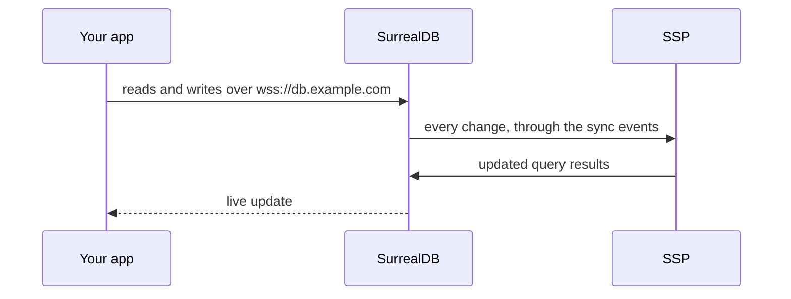

import CodeBlock from '../../components/ui/CodeBlock.astro';
import Note from '../../components/ui/Note.astro';
import Warning from '../../components/ui/Warning.astro';
import Steps from '../../components/ui/Steps.astro';
import Step from '../../components/ui/Step.astro';
import CardGrid from '../../components/ui/CardGrid.astro';
import LinkCard from '../../components/ui/LinkCard.astro';

export const envFile = `# Your images and your CLI must be the same version (spky --version)
SPOOKY_VERSION=0.0.1-canary.283

# The domain your app connects to. Point its DNS at this server.
DB_DOMAIN=db.example.com

# Long random values, e.g. from: openssl rand -hex 32
SURREAL_PASS=change-me
SPKY_AUTH_SECRET=change-me`;

export const caddyFile = `{$DB_DOMAIN} {
	reverse_proxy surrealdb:8000
}`;

export const composeSingle = `services:
  surrealdb:
    image: surrealdb/surrealdb:v3.1.0-beta.3
    user: root
    command: start --allow-all rocksdb:/data/db
    environment:
      SURREAL_USER: root
      SURREAL_PASS: \${SURREAL_PASS}
      SURREAL_CAPS_ALLOW_EXPERIMENTAL: files,surrealism
    volumes:
      - surrealdb:/data
    restart: unless-stopped

  ssp:
    image: mono424/spooky-ssp:\${SPOOKY_VERSION}
    environment:
      SPKY_DB_URL: http://surrealdb:8000
      SPKY_DB_NS: main
      SPKY_DB_NAME: main
      SPKY_DB_USER: root
      SPKY_DB_PASS: \${SURREAL_PASS}
      SPKY_AUTH_SECRET: \${SPKY_AUTH_SECRET}
      # Restart from a snapshot instead of re-reading the whole database
      SPKY_SSP_SNAPSHOT_DIR: /data/snapshot
      SPKY_SSP_ARENA_DIR: /data/arena
    volumes:
      - ssp:/data
    ports:
      - "127.0.0.1:8667:8667" # health checks from the server only
    depends_on:
      - surrealdb
    restart: unless-stopped

  caddy:
    image: caddy:2
    environment:
      DB_DOMAIN: \${DB_DOMAIN}
    ports:
      - "80:80"
      - "443:443"
    volumes:
      - ./Caddyfile:/etc/caddy/Caddyfile:ro
      - caddy:/data
    restart: unless-stopped

volumes:
  surrealdb:
  ssp:
  caddy:`;

export const upCmd = `docker compose up -d
curl localhost:8667/health`;

export const applyCmd = `export SURREAL_URL=https://db.example.com
export SURREAL_PASS=<SURREAL_PASS from .env>

spky migrate apply --endpoint http://ssp:8667 --secret <SPKY_AUTH_SECRET from .env>`;

export const clientCfg = `const dbConfig: SyncedDbConfig<typeof schema> = {
  // ...
  database: {
    endpoint: 'wss://db.example.com/rpc',
    namespace: 'main',
    database: 'main',
  },
};`;

export const schemaChange = `spky migrate create add_due_date
spky migrate apply --endpoint http://ssp:8667 --secret <SPKY_AUTH_SECRET>`;

export const upgradeCmd = `docker compose pull
docker compose up -d
spky migrate apply --endpoint http://ssp:8667 --secret <SPKY_AUTH_SECRET>`;

export const jobCfg = `  ssp:
    environment:
      # ...
      SPKY_JOB_CONFIG: '[{"name":"api","base_url":"http://api:3000","table":"job"}]'

  api:
    image: registry.example.com/my-api:latest
    environment:
      SPKY_DB_URL: http://surrealdb:8000
      SPKY_DB_NS: main
      SPKY_DB_NAME: main
      SPKY_DB_USER: root
      SPKY_DB_PASS: \${SURREAL_PASS}
    restart: unless-stopped`;

export const composeScheduler = `  scheduler:
    image: mono424/spooky-scheduler:\${SPOOKY_VERSION}
    environment:
      SPKY_DB_URL: http://surrealdb:8000
      SPKY_DB_NS: main
      SPKY_DB_NAME: main
      SPKY_DB_USER: root
      SPKY_DB_PASS: \${SURREAL_PASS}
      SPKY_AUTH_SECRET: \${SPKY_AUTH_SECRET}
      SPKY_ADMIN_PASSWORD: \${SPKY_ADMIN_PASSWORD}
    volumes:
      - scheduler:/data # replica and write-ahead log
    ports:
      - "127.0.0.1:9668:9668" # dashboard. Never publish 9667.
    depends_on:
      - surrealdb
    restart: unless-stopped

  ssp:
    image: mono424/spooky-ssp:\${SPOOKY_VERSION}
    environment:
      # ...everything from before, plus:
      SPKY_SCHEDULER_URL: http://scheduler:9667
      SPKY_SSP_ID: ssp-0
      SPKY_SSP_ADVERTISE_ADDR: ssp:8667
    depends_on:
      - scheduler

volumes:
  # ...
  scheduler:`;

export const applyCluster = `spky migrate apply --endpoint http://scheduler:9667 --secret <SPKY_AUTH_SECRET>`;

export const tunnelCmd = `ssh -L 9668:localhost:9668 you@your-server
# then open http://localhost:9668/admin`;

export const caddyAdmin = `{$DB_DOMAIN} {
	reverse_proxy surrealdb:8000
}

admin.example.com {
	reverse_proxy scheduler:9668
}`;

export const composeSecondSsp = `  ssp-1:
    image: mono424/spooky-ssp:\${SPOOKY_VERSION}
    environment:
      # ...same as ssp, except:
      SPKY_SSP_ID: ssp-1
      SPKY_SSP_ADVERTISE_ADDR: ssp-1:8667
    volumes:
      - ssp-1:/data
    depends_on:
      - scheduler
    restart: unless-stopped

volumes:
  # ...
  ssp-1:`;

A self-hosted sp00ky is two containers. **SurrealDB** holds your data, and the
**SSP** keeps every live query up to date. Your app connects to SurrealDB
directly, so the SSP never has to be reachable from the internet.

<Note title="One SSP is enough">
A single SSP serves every live query for every connected user, and also runs
your jobs, schedules, workflows, backend health checks and backups. It carries
large projects on its own. Add a [scheduler](#add-the-scheduler) when you want
the operator dashboard, and a second SSP only when one machine runs out of
memory or CPU.
</Note>

## What you need

- A Linux server with Docker and Docker Compose, ports 80 and 443 open.
- A domain for the database, for example `db.example.com`, with its DNS pointing
  at the server. Caddy uses it to get a TLS certificate automatically.
- Your sp00ky project and the `spky` CLI on your own machine.

## Set it up

<Steps>
  <Step title="Write the .env file">
    On the server, create an empty directory with a `.env` file in it. Compose
    reads it automatically, and every value below is used in the next steps.

    <CodeBlock code={envFile} lang="bash" fileName=".env" />
  </Step>

  <Step title="Add the Caddyfile and docker-compose.yml">
    Caddy terminates TLS for your domain and forwards it to SurrealDB,
    WebSockets included. If you already run a reverse proxy, drop the `caddy`
    service and point your proxy at `surrealdb:8000` instead.

    <CodeBlock code={caddyFile} lang="text" fileName="Caddyfile" />

    <CodeBlock code={composeSingle} lang="yaml" fileName="docker-compose.yml" />

    `SPKY_DB_NS` and `SPKY_DB_NAME` must match `surrealdb.namespace` and
    `surrealdb.database` in your `sp00ky.yml`. Both default to `main`.
  </Step>

  <Step title="Start it">
    <CodeBlock code={upCmd} lang="bash" />

    The SSP answers with a short JSON status. Once it contains
    `"status":"ready"`, it is up.
  </Step>

  <Step title="Apply your schema">
    From your project directory on your own machine, apply your migrations
    together with the sync events sp00ky adds to every table:

    <CodeBlock code={applyCmd} lang="bash" />

    - `SURREAL_URL` is how **your machine** reaches SurrealDB.
    - `--endpoint` is how **SurrealDB** reaches the SSP. The sync events call
      it on every write, from inside the Docker network, so it is the service
      name `ssp` and not your domain.
    - `--secret` must be the exact `SPKY_AUTH_SECRET` from `.env`, or the SSP
      rejects every change.
  </Step>

  <Step title="Point your app at it">
    Set the client's endpoint to your domain. Namespace and database are the
    same as above.

    <CodeBlock code={clientCfg} lang="typescript" />

    If your client sets `enableAnonymousLiveQueries: true`, add
    `SPKY_SSP_ANON_LIVE_QUERIES: "true"` to the SSP as well. The two must agree,
    or signed-out users get no live updates.
  </Step>
</Steps>

That is a complete production setup. Everything below is optional.

## Everyday tasks

### Change the schema

Create a migration as usual, then apply it with the same command as the first
time:

<CodeBlock code={schemaChange} lang="bash" />

The SSP notices new and changed tables on its own within 15 seconds. No restart
needed.

### Upgrade

Update the CLI, set `SPOOKY_VERSION` in `.env` to the version it prints, then
pull the new images and re-apply so the sync events match the new version:

<CodeBlock code={upgradeCmd} lang="bash" />

### Back up

Add the `S3_*` variables from [Backup storage](#backup-storage) to the SSP and
it can export SurrealDB to any S3-compatible bucket and restore from it,
through the [backup routes](/docs/reference/ssp-api#standalone-maintenance). With
the [scheduler](#add-the-scheduler), the dashboard does this for you.

## Backends and jobs

If your `sp00ky.yml` has [backends](/docs/backend) that take jobs from an
outbox table, run each one as another service in the same compose file and tell
the SSP where to send the jobs:

<CodeBlock code={jobCfg} lang="yaml" fileName="docker-compose.yml" />

`table` is the backend's outbox table (`method.table` in `sp00ky.yml`) and
`base_url` is how the SSP reaches the backend on the Docker network. With no
backends, leave `SPKY_JOB_CONFIG` out.

## Add the scheduler

The scheduler sits between SurrealDB and your SSPs. You still run one SSP. What
you get:

- The [operator dashboard](#operator-dashboard) and its [MCP server](/docs/reference/mcp).
- A replica of your database, so an SSP restart loads from the replica instead
  of reading everything from SurrealDB again.
- An end-to-end heartbeat that can page you through a webhook, and drift checks
  that repair the replica on their own.
- The option to [run more SSPs](#run-more-than-one-ssp) later.

To switch:

1. Set `mode: cluster` in your `sp00ky.yml`.
2. Add `SPKY_ADMIN_PASSWORD` (another long random value) to `.env`.
3. Add the `scheduler` service and point the SSP at it:

<CodeBlock code={composeScheduler} lang="yaml" fileName="docker-compose.yml" />

4. Run `docker compose up -d`, then apply again with the scheduler as the
   endpoint, since the sync events now go to the scheduler instead of the SSP:

<CodeBlock code={applyCluster} lang="bash" />

<Warning title="Never publish port 9667">
The scheduler listens on two ports and they are not equivalent. Port **9667**
is the ingest plane, and every route on it is unauthenticated by design because
it is meant to be reachable only from inside your private network. That
includes `POST /proxy/query`, which runs **arbitrary SurrealQL against the
replica** for any caller that can open a socket to it. Publishing 9667 hands
your database to the internet.

Port **9668** is the admin plane. It is authenticated, and it is the only
scheduler port you ever expose.
</Warning>

### Operator dashboard

The dashboard shows the health of the scheduler and every SSP, end-to-end sync
latency, backend health, live logs and workflow runs. It can restart SSPs,
cancel and retry workflow runs, pause schedules and take backups.

The compose file above binds it to the server itself. Reach it over an SSH
tunnel:

<CodeBlock code={tunnelCmd} lang="bash" />

Or give it its own domain by adding a second block to the Caddyfile:

<CodeBlock code={caddyAdmin} lang="text" fileName="Caddyfile" />

Sign in with `SPKY_ADMIN_PASSWORD`, the break-glass login that works even when
the database is down, or with a normal app account after `spky admin add <user>`
puts it on the admin roster.

The same port serves the [MCP server](/docs/reference/mcp) at `/admin/api/mcp`,
so an AI assistant can read and operate the deployment with tokens minted on
the dashboard's Access page.

A few actions only work on Sp00ky Cloud, because they manage containers rather
than processes: pulling newer images, wiping the scheduler volume, restarting
SurrealDB, and the managed backup catalog, schedule and retention. The
dashboard shows them greyed out with the reason `Not linked to Sp00ky Cloud`.
See [Admin dashboard](/docs/reference/admin-dashboard) for the full surface.

### Run more than one SSP

Only when one SSP runs out of memory or CPU. Each extra SSP needs its own id,
address and volume:

<CodeBlock code={composeSecondSsp} lang="yaml" fileName="docker-compose.yml" />

The scheduler spreads views across the SSPs by load. Keep
`SPKY_CLEAR_VIEWS_ON_START` at its default (`true`) while you run more than one.

---

## Environment variables

Every variable the SSP and the scheduler read, with its default. The setups above only need the handful they show; reach for these when you tune or debug.

### SSP (Sidecar)

Read straight from the process environment.

| Variable | Description | Default |
| :--- | :--- | :--- |
| `SPKY_SSP_LISTEN_ADDR` | Address and port for the SSP HTTP server | `0.0.0.0:8667` |
| `SPKY_AUTH_SECRET` | Bearer token for authenticating SSP API requests. When unset the auth middleware accepts any bearer (dev only). | *(empty)* |
| `SPKY_DB_URL` | SurrealDB URL (HTTP engine; `ws://` values are accepted and normalized) | `http://127.0.0.1:8000` |
| `SPKY_DB_WS` | Legacy fallback for `SPKY_DB_URL` (any scheme accepted) | *(unset)* |
| `SPKY_DB_USER` | SurrealDB username | `root` |
| `SPKY_DB_PASS` | SurrealDB password | `root` |
| `SPKY_DB_NS` | SurrealDB namespace | `test` |
| `SPKY_DB_NAME` | SurrealDB database | `test` |
| `SPKY_SCHEDULER_URL` | Scheduler URL (enables distributed mode) | *(unset)* |
| `SPKY_SSP_ID` | Unique SSP identifier | `ssp-<uuid>` |
| `SPKY_SSP_ADVERTISE_ADDR` | Externally reachable `host:port` for this SSP | *(unset)* |
| `HEARTBEAT_INTERVAL_MS` | Heartbeat interval in ms | `5000` |
| `TTL_CLEANUP_INTERVAL_SECS` | View TTL cleanup interval | `60` |
| `SPKY_SCHEMA_POLL_SECS` | How often (seconds) the SSP probes upstream's schema and applies added, changed and removed tables in place, with no restart or rebuild. `0` turns the poll off; a view registration naming a table the SSP does not know yet still refreshes. | `15` |
| `SPKY_INGEST_TRANSPORT` | Standalone mode only (no `SPKY_SCHEDULER_URL`): `changefeed` makes the SSP tail SurrealDB's `CHANGEFEED` itself instead of receiving `/ingest` posts from the DB events. Takes the same `SPKY_CHANGEFEED_*` knobs as the scheduler. In cluster mode the scheduler tails. | `http` |
| `SPKY_SSP_REF_MODE` | `_00_list_ref` storage layout: `dedicated` (per-user tables; works around the SurrealDB v3 LIVE permission gap) or `single` (legacy shared table). Mirrors `refMode` in `sp00ky.yml`. | `dedicated` |
| `SPKY_SSP_QUERY_UPDATE_THROTTLE_MS` | Window (ms) over which the SSP coalesces query edge-update writes to `_00_list_ref` into one batched transaction, so a burst of view updates lands as a few batched `LIVE` deliveries instead of one transaction per record. `0` disables batching (flush each update immediately). See [Architecture](/docs/reference/architecture#edge-update-batching). | `100` |
| `SPKY_JOB_CONFIG` | JSON array of the backends the SSP dispatches jobs to: `[{"name":"api","base_url":"http://api:3000","table":"job"}]`, with optional `auth_token` and `timeout` per entry. See [Backends and jobs](#backends-and-jobs). The literal `null` disables the job runner, so pass `[]` for none. | *(unset)* |
| `SPKY_CRDT_CACHE_SIZE` | In-memory CRDT cache capacity | `10000` |
| `SPKY_CRDT_FIELDS` | JSON override for `@crdt` field detection, e.g. `{"thread":["content"]}` | *(auto)* |
| `SPKY_SSP_BOOTSTRAP_PAGE_SIZE` | Rows pulled per `/proxy/query` page | `500` |
| `SPKY_SSP_REGISTER_MAX_WAIT_SECS` | How long to keep retrying scheduler registration before exiting for a restart | `180` |
| `SPKY_SSP_ANON_LIVE_QUERIES` | Allow live queries from unauthenticated clients (`1`/`true` to enable) | `false` |
| `SPKY_SSP_QUERY_ALLOWLIST` | `off`, `warn` or `enforce`. Compare every `/view/register` shape against the `_00_query_allowlist` rows the CLI publishes; `warn` logs and admits a miss, `enforce` refuses it with 403 `not_allowlisted`. Mirrors `sync.queryAllowlist` in `sp00ky.yml`. See the [Query allowlist guide](/docs/guide/query-allowlist). | `off` |
| `SPKY_SSP_VIEW_METRICS_FLUSH_MS` | How often view metrics are flushed to the database | `2000` |
| `SPKY_SSP_MEMORY_LIMIT_MB` | Memory ceiling this SSP reports itself against. The heartbeat sends usage as a fraction of it, which is what the scheduler's `LeastLoad` strategy ranks on, so an unset or wrong value skews balancing. | `1024` |
| `OTEL_EXPORTER_OTLP_ENDPOINT` | OpenTelemetry collector endpoint for SSP metrics | *(unset)* |
| `OTEL_SERVICE_NAME` | OTEL service identifier | `ssp` |

#### Circuit persistence

Without a snapshot directory every restart is a cold rebuild: the SSP re-pages
the whole database while the scheduler holds sync frozen. Point these at a
volume and a restart restores the snapshot and catches up only what it missed.
Both are caches of SurrealDB, never the source of truth, so deleting them is
always safe. See [State persistence](/docs/reference/ssp-api#state-persistence).

| Variable | Description | Default |
| :--- | :--- | :--- |
| `SPKY_SSP_SNAPSHOT_DIR` | Directory for what the SSP keeps across a restart: row checkpoints in `rows/` on a cluster SSP (verified against the scheduler on boot), the circuit snapshot (`snapshot.json`) on a standalone one. Enabled when set and writable; the SSP probes it and falls back to memory-only rather than failing startup. Put it on a volume that outlives the container. | *(unset)* |
| `SPKY_SSP_ROW_CHECKPOINT_SECS` | Cluster SSP: how often tables whose content changed are written to `rows/` while running. `0` leaves only the writes on graceful shutdown and after each bootstrap. | `1800` |
| `SPKY_SSP_CHECKPOINT_INTERVAL_SECS` | Standalone SSP: how often the snapshot is rewritten while running. Only read when `SPKY_SSP_SNAPSHOT_DIR` is set, which arms the timer. | `300` |
| `SPKY_SSP_ARENA_DIR` | Directory for the row arena, a sparse-file cache of row bytes. Probed for writability like the snapshot dir; falls back to the heap. | *(unset)* |
| `SPKY_SSP_ARENA_SEGMENT_MB` | Arena segment size in MB | `64` |

### Scheduler

The scheduler reads most of its config from `sp00ky.yml`, and the `SPKY_*` vars
in the first table below override the corresponding YAML field. The fields
`ingest_host`, `ingest_port`, `load_balance`, `replica_db_path`, `wal_path`,
`ssp_poll_interval_ms`, `max_buffer_per_ssp` and `job_tables` are YAML only.

The tables after it are env only and have no YAML equivalent: the admin plane,
backup storage, the dead-man heartbeat, and the tuning knobs.

#### Core

| Variable | Description | Default |
| :--- | :--- | :--- |
| `SPKY_SCHEDULER_ID` | Unique scheduler identifier | `scheduler-<uuid>` |
| `SPKY_DB_URL` | SurrealDB URL (HTTP engine; `ws://` values are accepted and normalized) | `http://localhost:8000` |
| `SPKY_DB_WS` | Legacy fallback for `SPKY_DB_URL` (any scheme accepted) | *(unset)* |
| `SPKY_DB_NS` | SurrealDB namespace | `sp00ky` |
| `SPKY_DB_NAME` | SurrealDB database | `sp00ky` |
| `SPKY_DB_USER` | SurrealDB username | `root` |
| `SPKY_DB_PASS` | SurrealDB password | `root` |
| `SPKY_SNAPSHOT_UPDATE_INTERVAL_SECS` | Snapshot update interval (seconds) | `300` |
| `SPKY_DRIFT_CHECK` | Compare the replica's row counts against upstream at startup and after each snapshot drain. Over a reused snapshot the startup check runs in the background, so SSPs can register while it counts | `true` |
| `SPKY_DRIFT_COUNT_CONCURRENCY` | Upstream `count()` queries one drift check runs at once | `4` |
| `SPKY_DRIFT_AUTO_RECLONE` | Act when the check confirms a mismatch: repair the table in place by sending the rows that differ through the ingest pipeline, and re-clone the replica (re-bootstrapping every SSP) only when a repair cannot fix it (`false` = report only) | `true` |
| `SPKY_DRIFT_CONFIRM_TICKS` | Consecutive checks a non-zero count mismatch must persist before acting (an empty table upstream has rows for is acted on immediately) | `2` |
| `SPKY_DRIFT_RECLONE_COOLDOWN_SECS` | Minimum seconds between automatic re-clones | `3600` |
| `SPKY_DRIFT_REPAIR_MAX_ROWS` | Most rows one in-place repair of a table the replica already held may send; a bigger difference falls back to a re-clone. A table new to the replica (added upstream, or with `@nosync` removed) is backfilled with no cap, in the background, and never re-cloned for | `2000` |
| `SPKY_DRIFT_REPAIR_TIMEOUT_SECS` | Deadline for one table repair, and the longest any repair (a backfill included) may go without finishing a page; past it the repair is abandoned, the upstream connection replaced, and the repair retried on the next check | `300` |
| `SPKY_DRIFT_CHECK_TIMEOUT_SECS` | Deadline for one drift check; past it the check is abandoned and the upstream connection replaced, so a wedged query cannot stop the replica draining | `120` |
| `SPKY_BOOTSTRAP_PAGE_SIZE` | Rows per page when the replica clone or a drift repair reads a table from upstream; the table is cut into id windows of three quarters of a page | about 32 MiB of rows by a one-row probe, at most `2000` |
| `SPKY_AUTH_SECRET` | Optional shared secret; when set, callers to `/proxy/*` must send `Authorization: Bearer <secret>`. Also signs admin dashboard sessions, so setting it is what makes them survive a restart. | *(empty)* |
| `SPKY_BACKENDS` | JSON-encoded backend health-check list (`SPKY_SCHEDULER_BACKENDS` accepted as legacy fallback) | *(unset)* |
| `SPKY_JOB_CONFIG` | The outbox tables whose jobs the scheduler recovers and re-dispatches. Takes the SSP's array as is (only each `table` is read) or an object keyed by table. Without it, recurring and delayed jobs are never re-dispatched after their first run. | *(unset)* |

#### Admin plane

The dashboard and its MCP server, on their own port. See
[Admin dashboard](/docs/reference/admin-dashboard).

| Variable | Description | Default |
| :--- | :--- | :--- |
| `SPKY_ADMIN_ENABLED` | Serve the admin plane at all. Set to `0`, `false` or `off` to disable it; any other value (or unset) enables it. | `true` |
| `SPKY_ADMIN_PORT` | Port for the admin plane | `9668` |
| `SPKY_ADMIN_HOST` | Bind address for the admin plane | `0.0.0.0` |
| `SPKY_ADMIN_DIR` | Directory holding the built dashboard. The official image ships one here; a scheduler built from a checkout serves a placeholder page instead. | `/usr/share/spooky/dashboard` |
| `SPKY_ADMIN_PASSWORD` | Break-glass password, which signs in without the `_00_admin` roster. An empty value is treated as unset, so a deployment that templates the var but leaves it blank does not end up with a guessable password. | *(unset)* |
| `SPKY_ADMIN_ACCESS` | Pins the SurrealDB record-access method used for admin sign-in. When unset the accesses are discovered from `INFO FOR DB`. | *(auto)* |
| `SPKY_ADMIN_SESSION_TTL_SECS` | How long a signed-in session lasts | `28800` (8h) |
| `SPKY_ADMIN_PRESENCE_INTERVAL_SECS` | How often the presence sampler reads `_00_query`, which feeds the Overview charts and the Views tab. One sampler serves every open dashboard, so this is the total cost however many people are watching. | `15` |
| `SPKY_ADMIN_SLOW_VIEW_MS` | Materialization p99 at which a registered view is counted as slow. Only the default; `GET /admin/api/views?slow_ms=` overrides it per request. | `250` |
| `SPKY_ADMIN_LARGE_VIEW_ROWS` | Row count from which a registered view is flagged as large. The Views tab and the Overview warn on these because an unwindowed live view republishes every row as a `_00_list_ref` edge on each cold registration, in one transaction, and a few thousand of those at once has stalled a tenant's SurrealDB. Window such queries (`LIMIT`/`START`) or resolve rows by id. `GET /admin/api/views?large=true` lists them. | `1000` |
| `SPKY_ADMIN_PRESENCE_MAX_ROWS` | Ceiling on the rows one presence or views query pulls back, so a tenant with a runaway number of registrations cannot make the sampler the expensive thing on the box. Above it the figures are reported as a floor. | `20000` |
| `SPKY_ADMIN_JOB_INTERVAL_SECS` | How often the job sampler reads your outbox tables, feeding the Jobs page, its totals and the Overview tile. Every job aggregate is a scan of one of your own tables, so one sampler takes them for every open dashboard. Set it to `0` to switch the sampler off entirely: the Jobs list and its filters still work, and the totals then report that they are not being measured rather than showing zeros. | `15` |
| `SPKY_ADMIN_JOB_LIVE_INTERVAL_SECS` | The cadence while at least one dashboard holds the Jobs stream open, so a backlog can be watched draining. Clamped to no slower than the idle interval. | `2` |

#### Machine pools

The listener [machine pool](/docs/jobs/machine-pools) agents connect to, and the `docker` provider a self-hosted scheduler can create machines with.

| Variable | Description | Default |
| :--- | :--- | :--- |
| `SPKY_POOL_ENABLED` | Serve pools at all. `0` or `false` turns the listener and the pool sweep off. | `true` |
| `SPKY_POOL_PORT` | Port of the pool listener | `9669` |
| `SPKY_POOL_HOST` | Bind address of the pool listener | `0.0.0.0` |
| `SPKY_POOL_PUBLIC_URL` | The listener's URL **as a machine reaches it**. Handed to every machine the scheduler creates. | `http://scheduler:<port>` |
| `SPKY_POOL_SECRET` | Key that signs each machine's token. Must survive restarts, or running machines are locked out and their jobs fail over. Falls back to `SPKY_AUTH_SECRET`. | *(SPKY_AUTH_SECRET)* |
| `SPKY_POOL_DOCKER` | Enable the `docker` provider: machines are containers on this scheduler's Docker host. Needs the Docker socket mounted. | *(off)* |
| `SPKY_POOL_DOCKER_NETWORK` | Docker network machine containers join, so they can reach `SPKY_POOL_PUBLIC_URL` | *(default bridge)* |
| `SPKY_POOL_AGENT_IMAGE` | Image carrying the `spky-agent` binary each machine runs. Defaults to the agent released with this scheduler, which is the one that speaks its protocol. | `mono424/spooky-agent:<release>` |

#### Backup storage

These carry **no `SPKY_` prefix**. The backup plane is enabled as soon as any of
`S3_ENDPOINT`, `S3_ACCESS_KEY`, `S3_SECRET_KEY` or `S3_BUCKET` is present, so a
partial configuration turns backups on with defaults filling the rest. Any
S3-compatible store works. Also read by a standalone SSP, which serves the same
backup routes.

| Variable | Description | Default |
| :--- | :--- | :--- |
| `S3_ENDPOINT` | S3-compatible endpoint | `http://10.100.1.5:9000` |
| `S3_ACCESS_KEY` | Access key | `minioadmin` |
| `S3_SECRET_KEY` | Secret key | `minioadmin` |
| `S3_BUCKET` | Bucket backups are written to | `backups` |
| `S3_REGION` | Region | `us-east-1` |
| `SPKY_PROJECT_SLUG` | Prefix backups are stored under, as `<slug>/<backup-id>.surql.gz`. Also what the dashboard lists when it is not linked to Sp00ky Cloud. | `default` |

#### Heartbeat and alerting

An end-to-end probe: the scheduler writes `_00_heartbeat:probe` upstream and
times the full round trip through `/ingest`, the WAL, the broadcast and every
SSP's circuit. It is what the dashboard's latency reading and the `/health`
staleness flag are built on.

| Variable | Description | Default |
| :--- | :--- | :--- |
| `SPKY_HEARTBEAT_INTERVAL_SECS` | Seconds between probe cycles. `0` disables the probe. | `30` |
| `SPKY_HEARTBEAT_TIMEOUT_SECS` | Deadline for one cycle. Clamped below the interval so a cycle always finishes before the next tick. | `25` |
| `SPKY_HEARTBEAT_FAIL_THRESHOLD` | Consecutive failed cycles before the alert fires | `3` |
| `SPKY_HEARTBEAT_PING_URL` | Dead-man URL pinged after each successful cycle, for an external uptime monitor | *(unset)* |
| `SPKY_ALERT_WEBHOOK_URL` | Webhook posted to when the probe crosses the failure threshold and again when it recovers | *(unset)* |
| `SPKY_HEALTH_MAX_HEARTBEAT_AGE_SECS` | How stale the last successful probe may be before `/health` degrades. Floored at `3 x interval + timeout`, so a smaller value has no effect. | *(computed)* |

#### Tuning

| Variable | Description | Default |
| :--- | :--- | :--- |
| `SPKY_WORKER_THREADS` | Tokio worker threads | `4` |
| `SPKY_HTTP_TIMEOUT_SECS` | Request deadline on the ingest plane, so a wedged handler produces a `408` rather than a hung connection. The admin plane is exempt because its log and event streams are meant to stay open. | `120` |
| `SPKY_HEALTH_MAX_LAG` | Ingest lag above which `/health` reports `degraded`. Unset means lag never degrades health. | *(unset)* |
| `SPKY_CLONE_TIMEOUT_SECS` | Ceiling on the initial replica clone. Overrunning it fails startup and exits, rather than leaving the scheduler wedged in `cloning` and answering 503 to every SSP for the life of the container. | `900` |
| `SPKY_BOOTSTRAP_TIMEOUT_SECS` | How long an SSP may take to bootstrap before the scheduler reaps it. Also half of what the dashboard waits on before calling a restart failed. | `300` |
| `SPKY_CLEAR_VIEWS_ON_START` | Wipe every registered view (`_00_query`) when the scheduler starts. `false` keeps them: the replica clones them, the SSPs re-register them at bootstrap, and clients keep their views across a scheduler restart with no re-registration; the SSP TTL sweep retires rows nobody heartbeats. Leave `true` on tenants with more than one SSP for now (every SSP would compute every view). | `true` |
| `SPKY_INGEST_TRANSPORT` | `http` (the generated DB events post to `/ingest`) or `changefeed` (the scheduler tails SurrealDB's `CHANGEFEED`; must match the schema deployed with `sync.transport`). See [Sync transport](/docs/reference/config#sync-transport). | `http` |
| `SPKY_CHANGEFEED_RETENTION` | The schema's `CHANGEFEED` retention, rendered form (`1d`). A cursor older than this minus the margin is a gap: the replica is re-cloned. | `1d` |
| `SPKY_CHANGEFEED_DOORBELL` | `LIVE SELECT id FROM _00_version` over WebSocket as the wake-up for the tail (plus a best-effort one on `_00_push_message`, so direct pushes do not wait for the fallback poll); `false` = poll only. | `true` |
| `SPKY_CHANGEFEED_DEBOUNCE_MS` | Wait after a doorbell wake before polling, so a bulk transaction costs one poll. | `5` |
| `SPKY_CHANGEFEED_FALLBACK_MS` | Safety-net poll interval while the doorbell is connected. | `2000` |
| `SPKY_CHANGEFEED_FALLBACK_DOWN_MS` | Poll interval while the doorbell is reconnecting. | `250` |
| `SPKY_CHANGEFEED_GAP_MARGIN_SECS` | Clock-skew allowance subtracted from the retention in the gap check. | `300` |
| `SPKY_CHANGEFEED_POLL_LIMIT` | Feed keys per `SHOW CHANGES` (SurrealDB counts one key per transaction and table). A poll that ends mid-transaction is re-read from that transaction. | `500` |
| `SPKY_CHANGEFEED_POLL_TIMEOUT_SECS` | Deadline for one `SHOW CHANGES`; past it the request is abandoned and the tail's session replaced. Also the ceiling of the outage a wedged `SHOW CHANGES` can cause on SurrealDB 3.1.5, so keep it short. | `5` |
| `SPKY_BOOTSTRAP_RECLONE_AFTER` | Consecutive bootstrap integrity failures before the replica is re-cloned from upstream | `3` |
| `SPKY_BOOTSTRAP_ADMIT_AFTER` | Consecutive bootstrap integrity failures before the SSP is admitted to broadcast anyway, restoring sync. Floored at the re-clone threshold, so admit never precedes a re-clone attempt. | `5` |
| `SPKY_CATCHUP_RECLONE_AFTER` | Same escalation for the catch-up gate | `3` |
| `SPKY_CATCHUP_ADMIT_AFTER` | Same escalation for the catch-up gate | `5` |

#### Web Push

The push engine runs in the scheduler in cluster mode and in the SSP in
singlenode mode (an SSP behind a scheduler never runs it), and reads the same
variables in both. It needs no configuration: its VAPID key is derived from
`SPKY_AUTH_SECRET`, and the rules come from `push:` in `sp00ky.yml`. See
[Push notifications](/docs/client/push-notifications).

Native push needs no variable either: the APNs and FCM credentials come from
`push.apns` / `push.fcm`, which `spky migrate` stores in the database
(`_00_push_credential`). The host needs outbound HTTPS (HTTP/2 for Apple) to
`api.push.apple.com`, `api.sandbox.push.apple.com`, `fcm.googleapis.com` and
`oauth2.googleapis.com`. See [Native push](/docs/client/native-push).

| Variable | Description | Default |
| :--- | :--- | :--- |
| `SPKY_PUSH` | `off` (or `0`, `false`, `no`, `disabled`) switches the engine off, web and native. Subscriptions and queued messages are kept. | *(on)* |
| `SPKY_VAPID_PRIVATE_KEY` | A VAPID private key (base64url raw P-256 scalar, the form web-push libraries print) to use instead of the one derived from `SPKY_AUTH_SECRET`. Set it on every host that runs the engine. Changing the key (or the secret it is derived from) invalidates every browser subscription: clients re-subscribe on their next boot through `db.webPush.sync()`. With neither this nor `SPKY_AUTH_SECRET`, push is off. | *(derived)* |
| `SPKY_PUSH_ALLOW_PRIVATE_ENDPOINTS` | Accept `http://` endpoints and private or local addresses, for a mock push service in development. Never in production: endpoints are chosen by your users and the engine posts to them from inside your network. | `false` |
| `SPKY_PUSH_SEND_CONCURRENCY` | Concurrent HTTP sends per matched row or tick | `8` |
| `SPKY_PUSH_DEDUPE_CAPACITY` | Rule matches remembered to drop duplicates (a row re-delivered by the changefeed look-back or a restart) | `100000` |
| `SPKY_PUSH_CONFIG_RELOAD_SECS` | How often the stored `push:` block is re-read, so a deploy's rule change is live within this | `30` |
| `SPKY_PUSH_DEFAULT_TTL_SECS` | Push-service TTL when neither the rule nor `push.defaults.ttl` sets one | `86400` |

<Note title="Injected by Sp00ky Cloud, not by you">
A managed deployment also receives `SPKY_CLOUD_API_URL` and
`SPKY_CLOUD_PROJECT` on the scheduler container. They are what let the
dashboard ask the control plane to upgrade images, wipe the volume or manage
the backup catalog, authenticated with the project's own `SPKY_AUTH_SECRET`.
Self-hosted schedulers leave them unset and report `cloud_linked: false`.
</Note>

## Next steps

<CardGrid>
  <LinkCard
    href="/docs/reference/admin-dashboard"
    title="Admin dashboard"
    description="Sign-in, restart and backup actions, and the full admin API."
  />
  <LinkCard
    href="/docs/reference/ssp-api"
    title="SSP API"
    description="The sidecar's HTTP contract, bootstrap and heartbeat behaviour."
  />
  <LinkCard
    href="/docs/reference/scheduler-api"
    title="Scheduler API"
    description="Ingest, proxy, health and the SSP coordination endpoints."
  />
  <LinkCard
    href="/docs/reference/mcp"
    title="MCP server"
    description="Let an AI assistant read and operate the deployment."
  />
</CardGrid>
